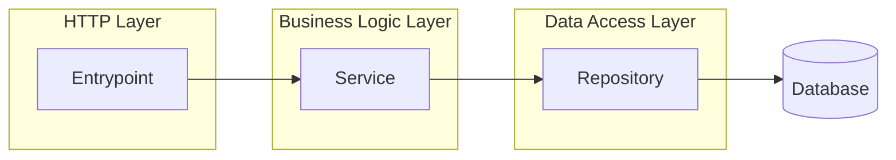

# Repository Infrastructure Example

*Note*: Parts of this documentation were written with AI assistance to improve clarity and organization; mostly because I'm better at writing code than writing about code :)


This project demonstrates patterns I've found reliable for building scalable backends: clean session management, explicit dependency wiring, and multi-entrypoint design. I'm using a simple **Organizations/Users** domain so you can focus on the infrastructure rather than complex business logic.

## Why I Built This

After building several Python backends, I kept running into the same infrastructure challenges. How do you handle database sessions cleanly? Where do you wire up your dependencies? How do you avoid global state while keeping things simple? **Especially** finding a good answer how to handle database sessions when dealing with FastAPI and how and where to pass the session drove me crazy for weeks.

This repository is my answer. It shows patterns that have worked well for me in production:

- **Session lifecycle management** – I'll show you how I create, inject, and dispose of database sessions without the mess
- **Explicit dependency wiring** – No magic, no globals. You can trace every dependency
- **Multiple entrypoints** – The same business logic powers an API, CLI, and Web UI
- **Production ready** – Logging, migrations, testing, Docker; all the things you actually need

I'm not trying to be academically perfect here. These are pragmatic patterns that scale as your codebase grows.

## Architecture Overview

Here's how I've structured the layers:



Each layer has a clear job, and dependencies flow in one direction.

### The Application Context Pattern

In every Python project that I write I introduce an **Application Context**. All three entrypoints (API, CLI, Web UI) use the same context that wires up:

- Database and cache clients
- Repositories and services
- Configuration settings

You get the benefits of dependency injection without needing a heavyweight DI framework. Everything is explicit and traceable.
(Also, I am unfortunately too busy to take my time to learn any DI framework currently.)

### Testing Strategy

I use self-cleaning fixtures extensively. Tests create state through the actual API and guarantee cleanup even when assertions fail. This keeps tests isolated and ensures you're testing the real system, not mocks.

## Tech Stack

Here's what I'm using:

| Category | Technologies |
|----------|-------------|
| **Core** | Python 3.14+, FastAPI, SQLModel, Pydantic |
| **Data** | PostgreSQL, Redis, Alembic |
| **Interfaces** | FastAPI (API), Typer (CLI), Streamlit (Web UI) |
| **Dev Tools** | pytest, Ruff, Basedpyright, pre-commit |
| **Tooling** | uv, poethepoet, Loguru, Faker |

## Getting Started

### What You'll Need

- Python ≥ 3.14
- [uv](https://docs.astral.sh/uv/getting-started/installation/) for dependency management
- A running PostgreSQL instance
- A running Redis instance

### Installation

```bash
# Clone the repository
git clone https://github.com/xflashxx/repository-infrastructure-example.git
cd repository-infrastructure-example

# Install everything (I recommend installing all dev dependencies)
uv sync --all-groups --all-extras --dev

# Copy the example config and customize it
cp example.env .env
# Edit .env with your database and Redis settings

# Apply database migrations
uv run alembic upgrade head
```

### Running It

Pick your interface:

```bash
# Start the HTTP API (available at http://0.0.0.0:8000)
poe api

# Use the command-line interface
poe cli

# Launch the web UI
poe webui
```

Once the API is running, check out the documentation at `/docs` (Swagger) or `/redoc`.

## Configuration

I use environment variables for all configuration via `pydantic-settings`. Nested settings use double underscores as separators—it keeps things clean.

### Database Setup

```bash
POSTGRES__HOST=localhost
POSTGRES__PORT=5432
POSTGRES__USERNAME=myuser
POSTGRES__PASSWORD=mypassword
POSTGRES__NAME=mydb
POSTGRES__SSL=false
```

### Cache Setup

```bash
REDIS__HOST=localhost
REDIS__PORT=6379
REDIS__PASSWORD=  # Optional
REDIS__TIMEOUT=0.5
REDIS__CLIENT_SIDE_CACHING=false

CACHE__BACKEND=REDIS
CACHE__KEYS_TTL=3600  # Seconds, or leave empty for no expiration
```

### API Authentication (Optional)

If you want to secure your API:

```bash
API__REQUIRE_AUTHENTICATION=true
API__API_KEY=your-secret-key
API__DOCUMENTATION_USERNAME=admin
API__DOCUMENTATION_PASSWORD=secure-password
```

When you enable authentication, you need to set all four values. Otherwise, just leave it disabled.

### Other Settings

```bash
REPOSITORY__BACKEND=POSTGRESQL  # This is the only option for now
LOGGING__LEVEL=INFO  # DEBUG | INFO | WARNING | ERROR | CRITICAL
```

There's a complete environment variables reference at the end if you need all the details.

## Working on the Code

### Code Quality

I've set up pre-commit hooks to catch issues early:

```bash
# Install the hooks
uv run pre-commit install

# And run the hooks
uv run pre-commit run --all-files --verbose
```

I use strict type checking because I'd rather catch errors at development time than in production.

### Running Tests

```bash
# Run the full suite with coverage
uv run pytest

# Run a specific test file
uv run pytest tests/test_organisations.py

# Verbose output if you need it
uv run pytest -v
```

Tests use FastAPI's `TestClient` and measure coverage against the `src/` directory.

### Database Migrations

```bash
# Apply pending migrations
uv run alembic upgrade head

# Create a new migration
uv run alembic revision --autogenerate -m "Description of changes"

# Roll back if needed
uv run alembic downgrade -1
```

Migrations run automatically when the app starts, but you can manage them manually with these commands.


## Deploying with Docker

I've included a Dockerfile for containerized deployment:

```bash
# Build the image
docker build -t repository-infrastructure-example .

# Run it with your config
docker run --env-file .env -p 8000:8000 repository-infrastructure-example
```

Make sure your `.env` file has all the necessary database and Redis connection details.

## Design Philosophy

These are the principles I followed:

- **Pragmatic over dogmatic** – I'm inspired by DDD but not married to it
- **Clear boundaries over clever abstractions** – If you can't trace it, it's too clever
- **Explicit wiring over magic** – Every dependency should be visible
- **Production-oriented** – This isn't a toy project—it includes everything you'd need in real deployment

I built this as a **learning and reference project**, not a framework. My hope is that you'll read through it, understand the patterns, and adapt what makes sense for your own projects.

## API Design Notes

The API is organized into focused routers:

- `/organisations` – Organization CRUD operations
- `/users` – User management
- `/health` – Health check endpoints

I've made authentication optional via API keys, and the documentation endpoints can be protected with HTTP Basic Authentication.

One thing I really like: you can test the API without starting a server using FastAPI's `TestClient`. It makes testing so much faster.

## Environment Variables Reference

Here's the complete list if you need to dig into specific settings.

### API Settings

| Variable | Type | Required | Default | Description |
|----------|------|----------|---------|-------------|
| `API__REQUIRE_AUTHENTICATION` | bool | No | `false` | Enable API authentication |
| `API__API_KEY` | string | Conditional* | - | API key for authentication |
| `API__DOCUMENTATION_USERNAME` | string | Conditional* | - | Username for docs access |
| `API__DOCUMENTATION_PASSWORD` | string | Conditional* | - | Password for docs access |

*Required when `API__REQUIRE_AUTHENTICATION=true`

### PostgreSQL Settings

| Variable | Type | Required | Default | Description |
|----------|------|----------|---------|-------------|
| `POSTGRES__HOST` | string | Yes | - | Database server host |
| `POSTGRES__PORT` | int | No | `5432` | Database server port |
| `POSTGRES__USERNAME` | string | Yes | - | Database username |
| `POSTGRES__PASSWORD` | string | Yes | - | Database password |
| `POSTGRES__NAME` | string | Yes | - | Database name |
| `POSTGRES__SSL` | bool | No | `false` | Enable SSL connection |

### Redis Settings

| Variable | Type | Required | Default | Description |
|----------|------|----------|---------|-------------|
| `REDIS__HOST` | string | Yes | - | Redis server host |
| `REDIS__PORT` | int | No | `6379` | Redis server port |
| `REDIS__PASSWORD` | string | No | - | Redis password |
| `REDIS__TIMEOUT` | float | No | `0.5` | Operation timeout (seconds) |
| `REDIS__HEALTH_CHECK_INTERVAL` | int | No | `30` | Health check interval (seconds) |
| `REDIS__CLIENT_SIDE_CACHING` | bool | No | `false` | Enable client-side caching |

### Cache Settings

| Variable | Type | Required | Default | Description |
|----------|------|----------|---------|-------------|
| `CACHE__BACKEND` | enum | No | `REDIS` | Cache backend to use |
| `CACHE__KEYS_TTL` | int | No | `null` | Default TTL (seconds), null = no expiration |

### Repository Settings

| Variable | Type | Required | Default | Description |
|----------|------|----------|---------|-------------|
| `REPOSITORY__BACKEND` | enum | No | `POSTGRESQL` | Repository implementation |

### Logging Settings

| Variable | Type | Required | Default | Description |
|----------|------|----------|---------|-------------|
| `LOGGING__LEVEL` | string | No | `INFO` | Log level (DEBUG/INFO/WARNING/ERROR/CRITICAL) |

## Who This Is For

You might find this useful if you're interested in:

- Repository and service patterns in Python
- Clean FastAPI architecture that doesn't over-engineer things
- Explicit dependency management without magic
- Building apps with multiple entrypoints

My advice: read through the code, understand the trade-offs I've made, and adapt what fits your situation. Don't just copy and paste—these patterns should inspire your own solutions.

## Final Thoughts

I created this repository because I wanted a reference point I could come back to when starting new projects. If you find it helpful, that's great. If you have suggestions or spot something that could be better, I'm all ears.

Feel free to open an issue or start a discussion on GitHub.

---

**License**: [MIT](https://opensource.org/licenses/MIT)
